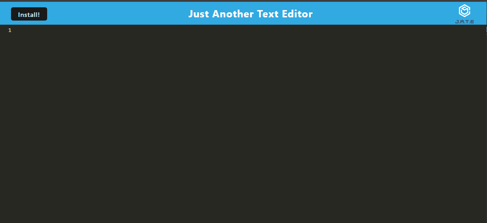

  # PWA Text Editor

  

  ## Description
  

  A progressive web application that is a text editor! A user can utilize this text editor either in browser or download the application to their machine. Visit the deployed application [here](https://pwa-text-editor-ul90.onrender.com)

  ## Table of Contents
  - [Installation](#installation)
  - [Usage](#usage)
  - [License](#license)
  - [Questions](#questions)

  ## Installation
 Clone my repo and ensure you have NodeJS version 20.10.0 or newer. Then install the dependencies by running npm i in your terminal. 

  ## Usage
 To check the contents in your database and ensure that your crud operations are working properly.

 ## License
 [MIT](https://opensource.org/licenses/MIT)

  ## Questions
  If you have any questions, contact me on [Github](https://github.com/AndrueGage/) or email me at trainer.andrue@gmail.com